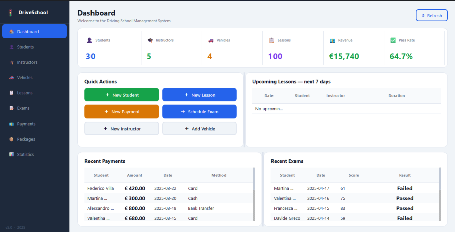
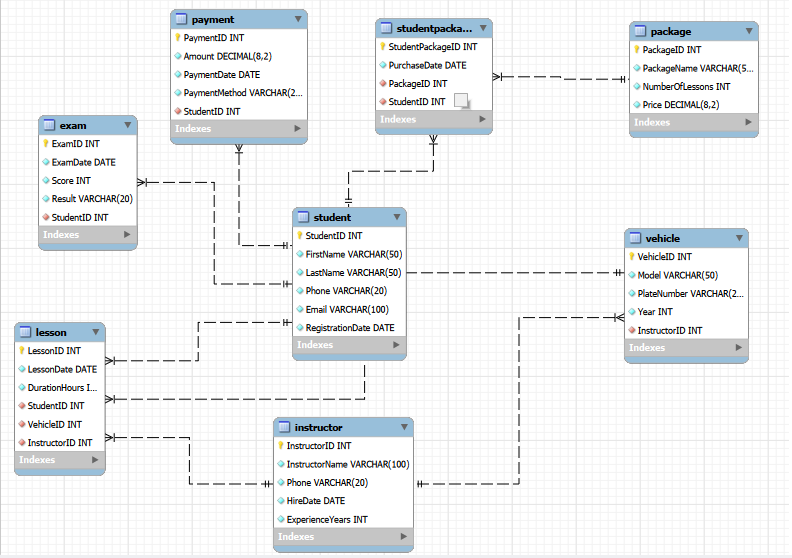

# Driving-School-Management-System-

A relational database and desktop application for running a driving school: students, instructors, vehicles, lessons, exams, payments and training packages. Built with **MySQL**, **Python** and **PyQt6**, with a **Pandas / Matplotlib** analysis notebook.

Data Management course project, A.Y. 2025/2026, University of Cassino and Southern Lazio (UNICAS).



## Features

- **MySQL database** with 8 tables in Third Normal Form, primary and foreign keys enforcing referential integrity.
- **Desktop app (PyQt6)** with nine pages: Dashboard, Students, Instructors, Vehicles, Lessons, Exams, Payments, Packages and Statistics. Every page has live search, sortable tables and a form to add, edit and delete records.
- **SQL analysis queries** for package revenue, instructor workload, exam results, vehicle utilization and pass rate by package.
- **Jupyter notebook** that loads the database into Pandas, cleans and joins the data, and produces the charts used in the report.

## Project structure

```
DrivingSchoolManagementSystem/
├── DrivingSchoolGUI.py          # the desktop application (run this)
├── db_config.py                 # shared database connection settings
├── check_connection.py          # quick test that MySQL and the data are ready
├── config.example.ini           # template for your own config.ini
├── requirements.txt             # Python packages
├── database/
│   ├── setup_database.sql       # creates mydb, all tables and sample data
│   ├── analysis_queries.sql     # the 5 analysis queries from the report
│   └── DrivingSchoolDB.mwb      # MySQL Workbench ER model
├── analysis/
│   └── DrivingSchoolAnalysis.ipynb
└── docs/
    ├── DrivingSchool_Project_Report.pdf
    ├── DrivingSchool_Project_Report.docx
    └── images/
```

## Getting started

You need three things installed: **Python 3.10+**, **MySQL Server 8** and **MySQL Workbench**.

### 1. Install MySQL Server

Download **MySQL Community Server** from <https://dev.mysql.com/downloads/mysql/> (Windows: the MSI installer). During configuration:

- keep the port as **3306**
- set a **root password** (the project default is `1234`; if you choose a different one, see step 4)
- leave **"Configure MySQL Server as a Windows Service"** and **"Start at System Startup"** ticked

Also install **MySQL Workbench** from <https://dev.mysql.com/downloads/workbench/>.

### 2. Get the code

```bash
git clone https://github.com/<your-username>/DrivingSchoolManagementSystem.git
cd DrivingSchoolManagementSystem
```

Or on GitHub click **Code → Download ZIP** and extract it.

### 3. Install the Python packages

```bash
python -m pip install -r requirements.txt
```

On macOS/Linux use `python3` instead of `python`.

### 4. Set your MySQL password (only if it is not `1234`)

Copy `config.example.ini` to a new file called `config.ini` in the same folder and change the password (and anything else that differs on your machine). `config.ini` is ignored by Git, so your password is never uploaded.

### 5. Create the database

1. Open **MySQL Workbench** and click your **Local instance** connection.
2. **File → Open SQL Script** → choose `database/setup_database.sql`.
3. Click the plain lightning-bolt button ⚡ (runs the whole script).
4. The last result should show `TotalStudents: 30`.

The script deletes and rebuilds `mydb` every time you run it, so it also works as a **reset** back to the sample data.

### 6. Check the connection

```bash
python check_connection.py
```

You should see row counts for all 8 tables (30 students, 100 lessons, ...).

### 7. Run the app

```bash
python DrivingSchoolGUI.py
```

In VS Code you can also open `DrivingSchoolGUI.py` and press **Run**. Make sure the interpreter shown at the bottom right is the same Python you installed the packages into.

### Optional: run the analysis notebook

```bash
cd analysis
jupyter notebook DrivingSchoolAnalysis.ipynb
```

Then **Run → Run All Cells**. It uses the same connection settings as the app.

## Database schema



| Table | Primary key | Foreign keys |
|---|---|---|
| Student | StudentID | — |
| Instructor | InstructorID | — |
| Vehicle | VehicleID | InstructorID |
| Package | PackageID | — |
| StudentPackage | StudentPackageID | StudentID, PackageID |
| Lesson | LessonID | StudentID, InstructorID, VehicleID |
| Exam | ExamID | StudentID |
| Payment | PaymentID | StudentID |

`database/setup_database.sql` is the source of truth for the schema used by the app.

## Troubleshooting

| Error | Cause | Fix |
|---|---|---|
| `ModuleNotFoundError: No module named 'mysql'` or `'PyQt6'` | Packages not installed in the Python you are running | `python -m pip install -r requirements.txt` using the **same** Python that runs the app |
| `2003: Can't connect to MySQL server on 'localhost:3306'` | MySQL server not running or not installed | Windows: `Win + R` → `services.msc` → start **MySQL80/MySQL84**. If it isn't listed, install MySQL Server (step 1) |
| `1045: Access denied for user 'root'` | Password differs from `1234` | Create `config.ini` (step 4) |
| `1049: Unknown database 'mydb'` | Database not created yet | Run `database/setup_database.sql` (step 5) |
| App opens but tables are empty | Setup script only partly ran | Re-run the whole script with the plain ⚡ button and check the Output panel for red errors |
| Workbench run buttons are greyed out | Script opened in an "unconnected" tab | Click your Local instance connection first, then open the script inside it |

## Built with

MySQL 8 · MySQL Workbench · Python · PyQt6 · mysql-connector-python · Pandas · Matplotlib · Jupyter

## Author

**Mohammad Mahdi Sarwari** — Economics with Data Science, UNICAS

Supervised by Prof. Ciro Russo, Data Management 2025/2026.
